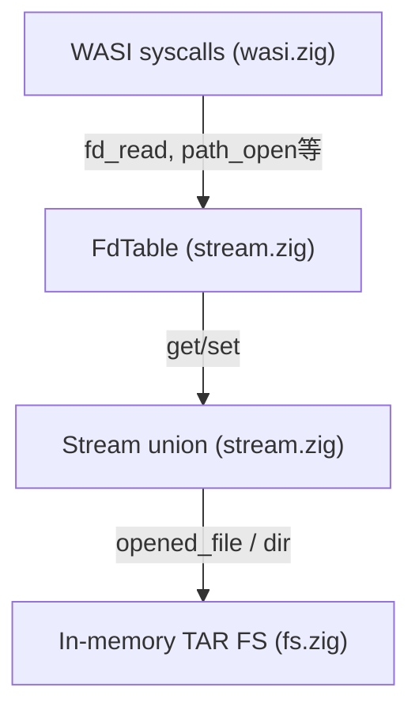
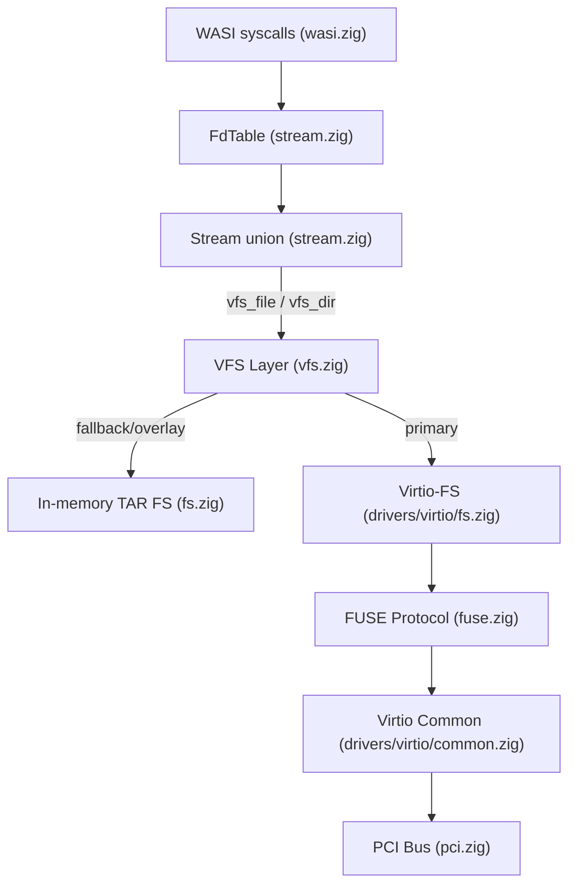
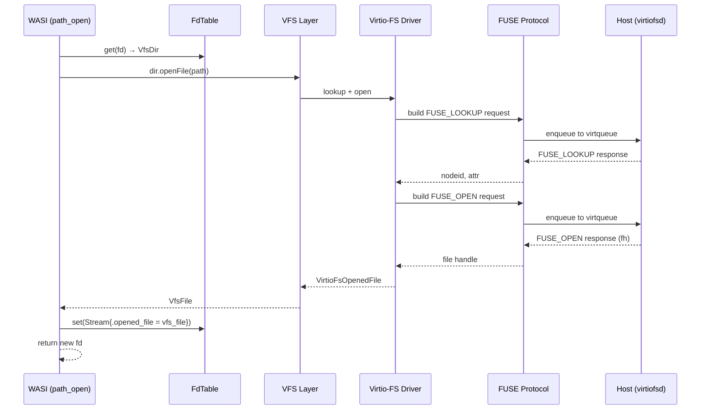

# Virtio-FS サポートの追加設計

## 現状の構造

現在のファイルシステムアーキテクチャは以下の通り:




- `Stream` union は `uart`, `socket`, `opened_file`, `dir` の4バリアントを持つ
- `fs.zig` はビルド時に埋め込まれたTARアーカイブからオンメモリで読み取り専用ファイルシステムを提供
- `path_open` は `Directory.getFileByName()` で線形検索してファイルを開く
- ファイルシステムは読み取り専用で、書き込み操作は未実装

## 設計方針

ユーザー（WASIアプリケーション）がvirtio-fsの存在を意識せずに使えるよう、**VFS（Virtual File System）抽象レイヤー**を導入し、既存のオンメモリFSとvirtio-fsを統一的に扱う。

## 全体アーキテクチャ




## 実装コンポーネント詳細

### 1. Virtio-FS デバイスドライバ (`src/drivers/virtio/fs.zig`)

既存の `net.zig` をテンプレートとして、virtio-fsデバイスドライバを実装する。

- **PCI デバイス検出**: vendor_id=`0x1af4`, device_id=`0x105a` (virtio file system, Device ID 26)
- **デバイス設定構造体**:

```zig
const VirtioFsDeviceConfig = packed struct {
    tag: [36]u8,      // ファイルシステムのタグ名
    num_queues: u32,   // リクエストキューの数
};
```

- **Virtqueue構成**: 仕様に従い、少なくとも2つのvirtqueueを使用
  - Queue 0: hiprio queue（FUSE_INTERRUPT, FUSE_FORGET用）
  - Queue 1: request queue（通常のFUSEリクエスト用）
- **初期化フロー**:
  1. PCIデバイス検出
  2. `Virtio(VirtioFsDeviceConfig).new()` でvirtioデバイス初期化
  3. IRQハンドラ登録
  4. FUSE_INITリクエスト送信でFUSEセッション開始
- **リクエスト/レスポンス処理**: virtqueueにFUSEリクエストをenqueueし、割り込みまたはポーリングでレスポンスを取得

### 2. FUSE プロトコル層 (`src/fuse.zig`)

FUSEプロトコルのメッセージ構造体とリクエスト/レスポンスのシリアライズ/デシリアライズを担当する。

- **主要構造体**:

```zig
const FuseInHeader = packed struct {
    len: u32,
    opcode: u32,
    unique: u64,
    nodeid: u64,
    uid: u32,
    gid: u32,
    pid: u32,
    padding: u32,
};

const FuseOutHeader = packed struct {
    len: u32,
    err: i32,  // 負のerrno値
    unique: u64,
};
```

- **実装するFUSEオペレーション** (最小限のサブセット):
  - `FUSE_INIT` (26): セッション初期化
  - `FUSE_LOOKUP` (1): パス名からinode検索
  - `FUSE_OPEN` (14): ファイルオープン
  - `FUSE_READ` (15): ファイル読み取り
  - `FUSE_WRITE` (16): ファイル書き込み（将来対応）
  - `FUSE_RELEASE` (18): ファイルクローズ
  - `FUSE_GETATTR` (3): ファイル属性取得
  - `FUSE_READDIR` (28) / `FUSE_READDIRPLUS` (44): ディレクトリ読み取り
  - `FUSE_FORGET` (2): inode参照カウント減少
  - `FUSE_OPENDIR` (27): ディレクトリオープン
  - `FUSE_RELEASEDIR` (29): ディレクトリクローズc
- **同期的リクエスト処理**: unikernelはシングルスレッドで動作するため、リクエスト送信後にレスポンスが返るまでポーリングで待機する同期モデルを採用。unique IDでリクエスト/レスポンスを対応付ける。

### 3. VFS 抽象レイヤー (`src/vfs.zig`)

既存のオンメモリFSとvirtio-fsを統一的に扱うための抽象レイヤー。

- **設計戦略: フォールバック方式**
  - virtio-fsデバイスが存在する場合はvirtio-fsを**プライマリ**として使用
  - virtio-fsデバイスが存在しない場合は既存のオンメモリTAR FSにフォールバック
  - ビルド時にTAR FSが埋め込まれており、かつvirtio-fsも利用可能な場合は、virtio-fsを優先し、見つからなければTAR FSにフォールバック（overlay方式）
- **VFS インターフェース**:

```zig
pub const VfsFile = struct {
    backend: union(enum) {
        mem_file: *fs.OpenedFile,
        virtio_file: VirtioFsOpenedFile,
    },
    
    pub fn read(self: *VfsFile, buffer: []u8) Stream.Error!usize { ... }
    pub fn size(self: *VfsFile) usize { ... }
};

pub const VfsDir = struct {
    backend: union(enum) {
        mem_dir: fs.Directory,
        virtio_dir: VirtioFsDirectory,
    },
    name: []const u8,
    
    pub fn openFile(self: *VfsDir, path: []const u8) ?VfsFile { ... }
};
```

- **初期化**: `vfs.init()` が `fs.init()` と `virtio_fs.init()` を呼び出し、利用可能なバックエンドを登録

### 4. Stream union の拡張 (`src/stream.zig`)

`Stream` union に VFS 経由のファイル/ディレクトリバリアントを追加する。

**方式A（推奨）: 既存バリアントを置き換え**

既存の `opened_file` と `dir` を VFS 対応版に置き換える:

```zig
pub const Stream = union(enum) {
    uart: void,
    socket: Socket,
    opened_file: VfsFile,   // fs.OpenedFile → vfs.VfsFile に変更
    dir: VfsDir,            // fs.Directory → vfs.VfsDir に変更
};
```

この方式なら `wasi.zig` の変更は最小限で済む。`Stream.read()` は `VfsFile.read()` にディスパッチし、VfsFile内部でバックエンドに応じた処理を行う。

### 5. ビルドシステムの変更 (`build.zig`)

- 新しいビルドオプション `-Dvirtio-fs=true` を追加（デフォルトはfalse）
- `options` に `has_virtio_fs: bool` を追加
- virtio-fsが有効な場合、`src/drivers/virtio/fs.zig` と `src/fuse.zig` をビルド対象に含める

### 6. 初期化フローの変更 (`src/main.zig`)

`[src/main.zig](src/main.zig)` の `bspEarlyInit` に virtio-fs の初期化を追加:

```
pci.init()
  → virtio_net.init() (if network enabled)
  → virtio_fs.init() (if virtio-fs device found on PCI bus)
  → vfs.init()       // fs.init() を内部で呼ぶ
```

virtio-fsデバイスの存在はPCIバス上で動的に検出するため、ビルドオプションではなく**ランタイム検出**とする方が柔軟。ただし、コードサイズを最小化したい場合はコンパイル時オプションも併用可能。

### 7. QEMU 起動スクリプトの変更 (`scripts/run-qemu.sh`)

virtio-fsを使用する場合、virtiofsdデーモンとQEMUの設定が必要:

```bash
# virtiofsd を起動
virtiofsd --socket-path=/tmp/vhostqemu -o source=/path/to/shared/dir &

# QEMU に virtio-fs デバイスを追加
QEMU_ARGS+=(
    "-chardev" "socket,id=char0,path=/tmp/vhostqemu"
    "-device" "vhost-user-fs-pci,queue-size=1024,chardev=char0,tag=myfs"
    "-m" "512"
    "-object" "memory-backend-file,id=mem,size=512M,mem-path=/dev/shm,share=on"
    "-numa" "node,memdev=mem"
)
```

## データフロー例: path_open




## 実装の優先順位

DAXウィンドウ（共有メモリによるゼロコピーアクセス）は初期実装では省略し、通常のFUSE_READ/FUSE_WRITEベースのデータ転送から始める。パフォーマンスが問題になった段階でDAXサポートを追加する。

## ファイル構成まとめ


| ファイル                        | 変更種別 | 内容                     |
| --------------------------- | ---- | ---------------------- |
| `src/drivers/virtio/fs.zig` | 新規   | Virtio-FSデバイスドライバ      |
| `src/fuse.zig`              | 新規   | FUSEプロトコル構造体・リクエスト処理   |
| `src/vfs.zig`               | 新規   | VFS抽象レイヤー              |
| `src/stream.zig`            | 変更   | Stream union にVFS型を統合  |
| `src/wasi.zig`              | 変更   | path_open等をVFS経由に変更    |
| `src/main.zig`              | 変更   | 初期化フローにvirtio-fs/VFS追加 |
| `src/fs.zig`                | 変更   | VFS互換インターフェースの追加       |
| `build.zig`                 | 変更   | ビルドオプション追加             |
| `scripts/run-qemu.sh`       | 変更   | virtio-fsデバイス設定追加      |


